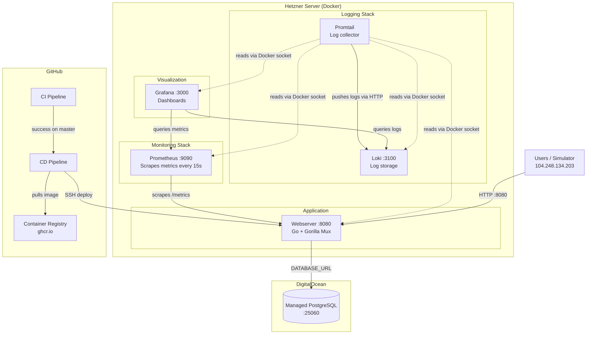

# Architecture

## Overview

ITU-MiniTwit is a Twitter clone built with Go (Gorilla Mux) and PostgreSQL. It runs on a single Hetzner Cloud VPS with all services containerized via Docker Compose. The database is an external DigitalOcean managed PostgreSQL instance.

## Components

| Component | Technology | Purpose |
|-----------|-----------|---------|
| Webserver | Go + Gorilla Mux + GORM | Application server, serves UI and simulator API |
| Database | DigitalOcean Managed PostgreSQL | Persistent data storage (users, messages, followers) |
| Prometheus | prom/prometheus | Scrapes application metrics (response times, request counts) |
| Grafana | grafana/grafana | Visualization for both metrics and logs |
| Loki | grafana/loki | Log aggregation and storage |
| Promtail | grafana/promtail | Collects container logs via Docker socket |

## System diagram

## Key design decisions

- **Loki over ELK**: Loki only indexes labels, not full text. Much lighter on resources for a single-server deployment.
- **Push vs Pull**: Prometheus pulls metrics from the app. Promtail pushes logs to Loki. Two different collection models.
- **Single Grafana**: One UI for both metrics (Prometheus) and logs (Loki), rather than separate tools like Kibana.
- **External database**: DigitalOcean managed PostgreSQL handles backups and availability, keeping the application server stateless.
- **Docker Compose**: All services on one host. Simple to operate for a small-scale project.
