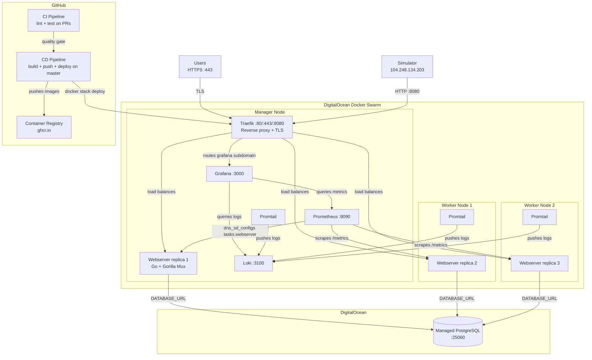

# Architecture

## Overview

ITU-MiniTwit is a Twitter clone built with Go (Gorilla Mux) and PostgreSQL. It runs on a 3-node Docker Swarm cluster on DigitalOcean with Traefik as reverse proxy and Let's Encrypt TLS. The database is an external DigitalOcean managed PostgreSQL instance.

## Components

| Component | Technology | Purpose |
|-----------|-----------|---------|
| Traefik | traefik:v3.4 | Reverse proxy, TLS termination, load balancing |
| Webserver (x3) | Go + Gorilla Mux + GORM | Application server, serves UI and simulator API |
| Database | DigitalOcean Managed PostgreSQL | Persistent data storage (users, messages, followers) |
| Prometheus | prom/prometheus | Scrapes application metrics (response times, request counts) |
| Grafana | grafana/grafana | Visualization for both metrics and logs |
| Loki | grafana/loki | Log aggregation and storage |
| Promtail | grafana/promtail (global) | Collects container logs via Docker socket on every node |

## System diagram

## Nodes

| Node | IP | Role |
|------|-----|------|
| Manager | 64.226.116.162 | Traefik, Prometheus, Grafana, Loki, 1 webserver replica, Promtail |
| Worker 1 | 206.189.59.60 | 1 webserver replica, Promtail |
| Worker 2 | 134.122.90.176 | 1 webserver replica, Promtail |

## Key design decisions

- **Docker Swarm over Kubernetes**: Swarm is simpler, built into Docker, and sufficient for our scale. The course covers Swarm specifically.
- **Traefik over Nginx/Caddy**: Native Docker/Swarm integration — auto-discovers services via labels, handles Let's Encrypt automatically. No config reloads when replicas change.
- **Rolling updates**: `parallelism: 1, order: start-first` — new replica starts before old one stops, ensuring zero-downtime deploys.
- **Loki over ELK**: Loki only indexes labels, not full text. Much lighter on resources.
- **Push vs Pull**: Prometheus pulls metrics from the app. Promtail pushes logs to Loki.
- **Single Grafana**: One UI for both metrics (Prometheus) and logs (Loki).
- **External database**: DigitalOcean managed PostgreSQL handles backups and availability, keeping webserver replicas stateless.
- **CookieStore sessions**: Session data lives in client cookies — no sticky sessions needed across replicas.
- **Swarm secrets**: Sensitive config (DATABASE_URL, SECRET_KEY, DISCORD_WEBHOOK_URL) stored as Docker secrets at `/run/secrets/`, with `getSecretOrEnv()` fallback for local dev.

## Legacy

A single-server Hetzner Cloud VPS (46.224.144.214) running docker-compose is kept as a legacy fallback. The CD pipeline deploys to both Hetzner and DO Swarm in parallel. Hetzner will be decommissioned once the Swarm is fully verified.
