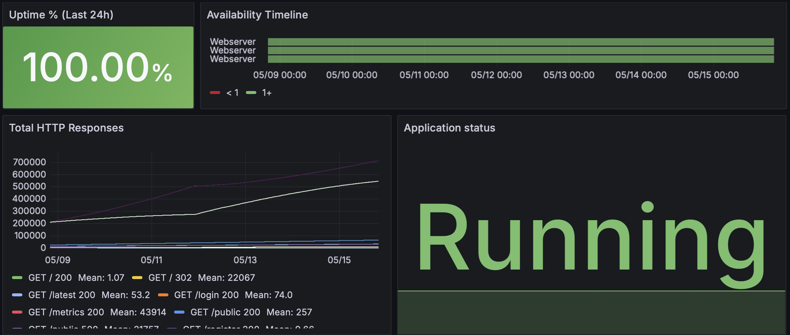
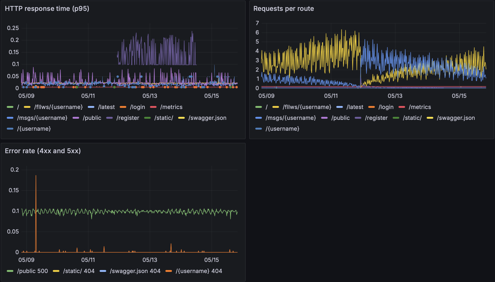
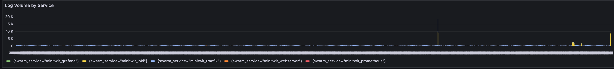

# System's Perspective

<!-- Suggested word budget: ~700 -->

## Design and Architecture 
**Author(s):** Peter K, Håkon
<!--
Describe and illustrate the system. Include diagrams from at least the
allocation and component-and-connector viewpoints (see session_12
Documentation.md). One UML deployment diagram + C&C is sufficient, maybe or maybe not one sequence diagram is a
good minimum.
-->

  - Deployment (allocation) diagram. Docker swarm overview / serverside understanding 
  - C&C viewpoint explaining the runtime components and their communication
  - Sequence diagram (maybe not so important - see Mirceas lecture slides)

## Dependencies
**Author(s):** Peter K
<!--
List and briefly describe all technologies and tools we depend on across
all stages: language/framework, infra, CI/CD, observability, third-party
services. Group by layer.
-->

## Current State
**Author(s):** Peter J

We run four static analysis tools in CI on every pull request, all blocking merges if they fail.

**golangci-lint** is our main Go linter. We have `errcheck`, `govet`, `staticcheck`, `ineffassign`, and `unused` enabled. `errcheck` catches unchecked errors in Go code, `govet` catches common mistakes like misused format strings, `staticcheck` does deeper analysis for bugs and dead code, and `ineffassign` and `unused` flag variables or code that serve no purpose.

**hadolint** lints the Dockerfile against a set of best practice rules — things like pinning base image versions, avoiding `apt-get upgrade`, and making sure `RUN` layers are structured cleanly.

**Semgrep** does static application security testing (SAST) using three rulesets: `p/security-audit` for general security issues, `p/secrets` for accidentally committed credentials, and `p/owasp-top-ten` for common web vulnerabilities like SQL injection and XSS.

**Docker Scout** scans the final built Docker image for known CVEs in the OS packages and dependencies. It's configured to fail the build if any critical or high severity vulnerability is found, so we catch issues in base image dependencies before they reach production.

# Process Perspective
<!-- Suggested word budget: ~1100 -->

## CI/CD Pipeline
**Author(s):** Peter K, Håkon & Apoorva

<!--
Stages and tools, from push to deployed replica. Cover deploy and release.
Activity diagram fits well here.
-->

  - Docker swarm in CD pipeline 

## Monitoring
**Author(s):** Peter J, Apoorva

For monitoring we use Prometheus to scrape metrics from the app, and Grafana to visualize them. Inside the Go application we added a middleware that wraps every HTTP handler and records two custom metrics: `minitwit_http_responses_total` (a counter per route, method, and status code) and `minitwit_http_duration_seconds` (a latency histogram). These get exposed on `/metrics` and Prometheus scrapes all three webserver replicas every 15 seconds using DNS-based service discovery on the Swarm overlay network — so adding or removing replicas requires no config changes.

We set up three alert rules in Prometheus: one that fires if a webserver replica has been unreachable for over a minute, one for when more than 10% of responses are 5xx errors over a five-minute window, and one for when P95 latency goes above 1 second for five minutes. All alerts are routed to a Discord channel through a Grafana contact point, using a webhook URL stored as a Docker Swarm secret so it never ends up in the codebase.

The Grafana setup is fully provisioned from code — datasources and dashboards are baked into a custom Docker image. The main dashboard covers uptime and availability across all replicas, total HTTP responses broken down by route, P95 response time, and a combined error rate panel. Over the week of 9–15 May we saw 100% uptime, and P95 response times stayed comfortably under 50 ms for the vast majority of the time.

## Logging
**Author(s):** Peter J

For logging we went with the Grafana LGTM stack — Promtail collects logs from every container and ships them to Loki, and Grafana lets us search and explore them.

Promtail runs as a global Swarm service, meaning one instance per node, so no replica gets skipped. It watches the Docker socket and auto-discovers containers, pulling in logs from all of them. For each container it tags logs with three labels: the container name, the Swarm service name (like `minitwit_webserver`), and the specific task/replica. These labels make it easy to filter down to exactly what you want in Grafana's log explorer.

On the Loki side, we use a simple single-node setup with filesystem storage and daily index rotation. Logs older than 7 days are dropped at ingestion to keep disk usage in check. The app itself just writes to stdout via Go's standard `log` package, which Docker captures automatically — no extra log library needed. We also enabled Traefik access logs so request-level data from the reverse proxy flows into Loki through the same pipeline, which turned out to be really useful for debugging.

The logging dashboard below shows log volume per Swarm service over time. Day-to-day it stays low and stable, with the occasional spike from Traefik or Loki itself when there is a burst of activity.

## Security Hardening
**Author(s):** Peter J

**Multi-stage Docker build.** The app Dockerfile uses two stages: a builder stage that compiles the Go binary, and a final `alpine:3.23` image that only contains the compiled binary, templates, and static files. The build tools are thrown away entirely, so the attack surface of the running container is minimal. We also create a dedicated non-root user (`appuser`) inside the image and drop to that user before the process starts, so even if something goes wrong inside the container it doesn't have root.

**Firewall.** Every node gets UFW rules applied automatically during Terraform provisioning. The manager node opens ports 80, 443, and 8080 for Traefik, plus SSH and the three Docker Swarm internal ports. Worker nodes only have the Swarm ports and SSH open — no public ports at all, so all traffic must go through Traefik on the manager. The database node only exposes SSH and Postgres (5432). On top of that, DigitalOcean's cloud firewall adds another layer at the network edge.

**TLS.** Traefik handles HTTPS via Let's Encrypt automatically. All HTTP traffic on port 80 is redirected to HTTPS, and certificates are stored in a named Docker volume so they persist across redeploys.

**Secrets.** Sensitive values like the database URL, app secret key, Discord webhook, and GHCR credentials are kept as Docker Swarm secrets or GitHub Actions secrets — never hardcoded or baked into images.

**Static analysis.** The CI pipeline runs `golangci-lint` on Go code, `hadolint` on the Dockerfile, and Semgrep for SAST on every push. These run as parallel jobs and block merges if they fail.

## Availability and Scaling
**Author(s):** Peter J, Apoorva

The webserver runs as three replicas with a `spread: node.id` placement preference in Docker Swarm, which tries to put replicas on different nodes so a single node going down doesn't take the whole service with it. Traefik automatically distributes traffic across whichever replicas are healthy.

Rolling updates are set to deploy one replica at a time with a 10-second pause between steps and `order: start-first` — this means the new replica comes up and passes its health check before the old one is taken down, so there is no gap in availability during a deploy. If an update goes bad, the rollback config mirrors the same approach, replacing one replica at a time.

Each replica runs a health check every 30 seconds (`wget --spider` against localhost) and Swarm stops routing to a replica if it starts failing. Combined with the Prometheus `WebserverDown` alert, we get two independent signals if something goes wrong — the load balancer stops sending traffic and we get a Discord notification within a minute.

The monitoring services (Prometheus, Grafana, Loki) each run as a single replica pinned to the manager node. We could have run them in a more resilient configuration, but these services all hold persistent state that is genuinely tricky to replicate without extra tooling, and a brief monitoring outage is much less bad than a complex distributed setup breaking in production. The webserver replicas are stateless and are the only part of the system we actually scale horizontally. If we ever needed more capacity on the database or monitoring side, vertical scaling (resizing the droplet) is the more practical option.

# Reflection Perspective
<!-- Suggested word budget: ~500 -->

## Evolution and Refactoring
**Author(s):** Håkon and Leo

<!-- DRAFT — anchored to docs/evolution.md (6-phase categorisation). Reflection threads cut across the phases. -->

The project went through six phases roughly — bootstrapping, CI/CD, observability, production infra, hardening, wrap-up. The same pattern ran through them: we usually only fixed things once they broke in the next phase. The `latest` counter sat in process memory until three replicas were about to disagree (PR #138). Prometheus labels used raw paths until cardinality blew up the scrape memory (PR #98). The personal timeline was fine until a real user hit 41–49 seconds and we rewrote it (PR #135).

Big-bang merges did the same thing on the deploy side — the Traefik 504 (#129) and the secret-path crash (#128) both only showed up after a `dev → master` landed in prod. And our hardening work came late: multi-stage Dockerfile, Semgrep, Docker Scout, Hetzner decommission (PRs #143–#160, #162) all landed weeks after the session that asked for them.

We refactored on demand, not on plan — kept us moving, but left bugs where phases met.

## Operation
**Author(s):** Leo and Apoorva

<!-- DRAFT — Apoorva: feel free to add a sentence about your fixes (firewall hardening / GHCR auth / Grafana persistence) within the word budget. -->

We ran two production stacks in parallel for most of April — Hetzner and DO Swarm, both against the same managed Postgres, from 10 April to 4 May. The simulator never noticed when we cut over, and the parallel run is what surfaced our worst outage. On the evening of 16 April a new DO cloud firewall silently blocked Swarm's overlay ports between our own nodes; `docker node ls` showed both workers Down, but the external uptime checks were still green. We rolled DNS back to Hetzner, fixed the firewall, bumped Traefik to v3.6 (PR #131), and only re-flipped once `curl --http2` came back 200.

Three replicas behind Traefik gave us the horizontal shape the course asked for, though we never benchmarked it against the single box.

**Control plane and data plane fail independently — uptime checks at the edge don't catch it.**

## Maintenance
**Author(s):** Leo

<!-- DRAFT v5 — trimmed for budget; quality-tool list lives here, not in DevOps Style. -->

On 4 May we turned on Codacy. Within a few hours it flagged a `/health` route bug that had been live for weeks. We fixed it in `c8ff76c`; the commit message just says *"caught by codacy."*

That catch is basically the whole maintenance story in miniature. Tooling landed one at a time, whenever someone got to it — linters in March (`bdb6c16`), image hardening with Semgrep and Docker Scout in April (PR #160), Codacy in May. Nobody owned maintenance as a thread of its own.

What nobody hit didn't get fixed. `helpers.go:55` still swallows the bcrypt error. `sim_api.go:33` still hardcodes the simulator auth header. The webserver log has 64,981 identical `superfluous WriteHeader` warnings nobody ever read. We have eleven test functions total, none on `store.go`. Issue #86 has been open since 13 March.

**What's good is good because someone hit it; what's bad is bad because nobody did. Maintenance needed an owner.**

## DevOps Style
**Author(s):** Leo

<!-- DRAFT v4 — Three Ways scoreboard. Quality-gate list moved to Maintenance to avoid duplication. -->

Session 5 asked us about the DevOps Handbook's Three Ways.

**Flow.** PR-only + CD-on-green from week one (PR #65); batch sizes never shrank — PRs #146–#160 are 10 self-merged hardening retries.

**Feedback.** Monitoring worked on 29 April. A CPU alert hit `#generelt` at 10:01 and we caught the timeline bug before users complained; by next morning we'd figured out the root cause. On 20 April it didn't — site went down, no alert fired, and we only noticed when someone opened the page.

**Continual Learning.** The 720-line debug doc we wrote live during the 17 April outage is what we'd hand to a new team member. The gap: two firewall incidents in 12 hours that day, no transfer between them.

For most of us this was the first time owning the Ops half — servers, certs, credentials, on-call. **The Dev/Ops bridge wasn't aspirational; it was the assignment.**

# Use of Generative AI
**Author(s):** Leo

<!-- Suggested word budget: ~200. Required per ITU GAI policy. -->

<!-- DRAFT — to revisit after other sections are written. -->

We used **Claude Code (Anthropic Opus 4.6, later 4.7)** all semester, in thinking mode mostly via the CLI; no other tools meaningfully. Claude commits carry `Co-Authored-By` trailers, and `.mailmap` maps the tool to `LLM <none>` as required.

Our group is five people, four without a CS bachelor. The DevOps stack — Go, Docker Swarm, Prometheus, Grafana, Postgres, Traefik, Terraform — was new to all of us, and we leaned on Claude to explain concepts we didn't yet have a feel for and as a scribe for running notes and incident write-ups. Looking back, two things we'd carry into a next project: declaring AI use more specifically (model, mode, context), and writing our own PRs and comments even when Claude had helped — both ways of showing we'd actually understood the work, not just shipped it.

It didn't help us when we wanted it to deliver answers in territory we couldn't read — debugging then turned into pasting things back and forth instead of thinking. Under time pressure it was tempting to take output we hadn't really understood.

**AI worked best at explaining and at checking work we already understood — worst when we wanted it to deliver answers we couldn't yet evaluate.**
